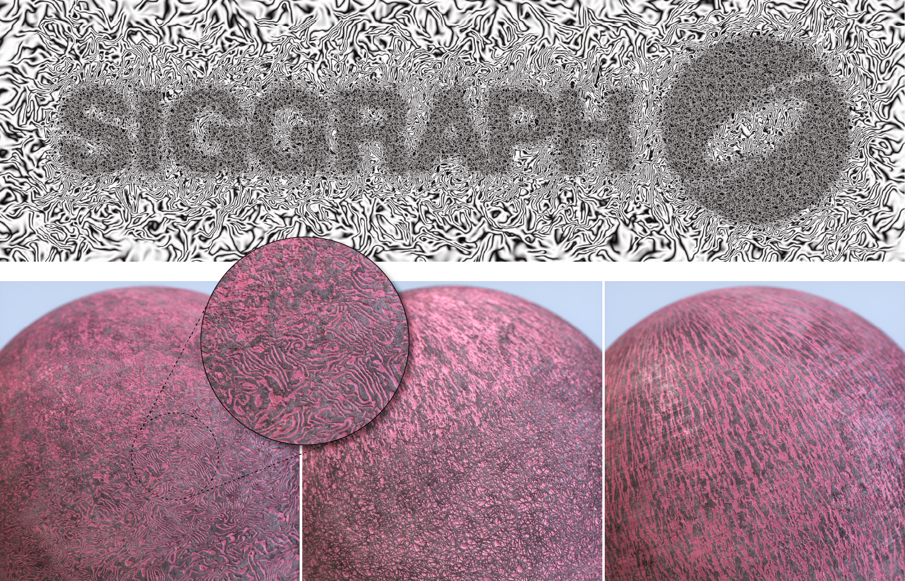

# One Noise to Rule Them All: Learning a Unified Model of Spatially-Varying Noise Patterns

### [Project Page](https://armanmaesumi.github.io/onenoise/) | [arXiv](https://arxiv.org/abs/2404.16292) | [bibtex](https://armanmaesumi.github.io/onenoise/resources/bibtex.txt)

Official code release for "[One Noise to Rule Them All: Learning a Unified Model of Spatially-Varying Noise Patterns](https://armanmaesumi.github.io/onenoise/)" by 	
Arman Maesumi, Dylan Hu, Krishi Saripalli, Vladimir G. Kim, Matthew Fisher, Sören Pirk, Daniel Ritchie.

## 🌟 Stay tuned! Code will be released soon.