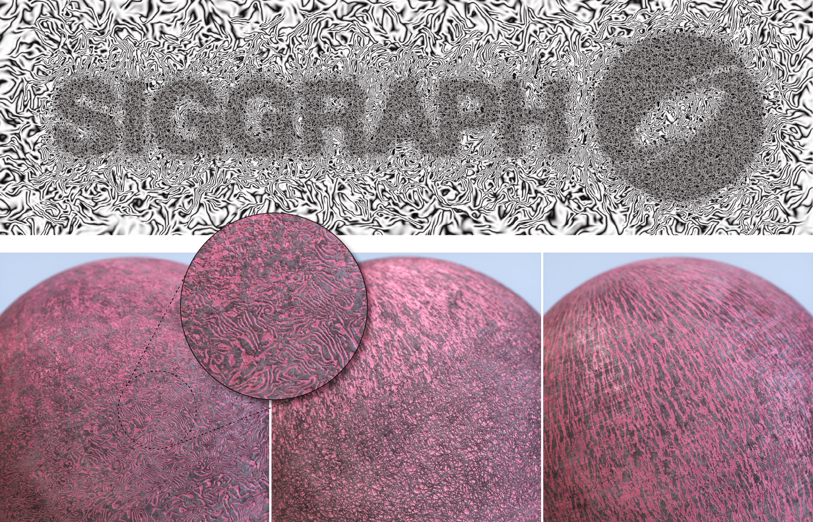
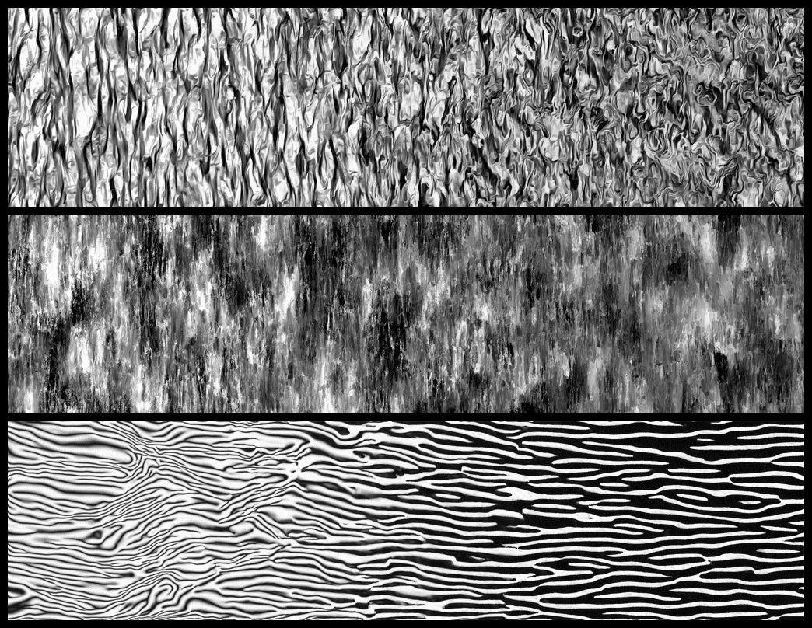

# One Noise to Rule Them All: <br>Learning a Unified Model of Spatially-Varying Noise Patterns

### [[Project Page]](https://armanmaesumi.github.io/onenoise/) / [[arXiv]](https://arxiv.org/abs/2404.16292) / [[bibtex]](https://armanmaesumi.github.io/onenoise/resources/bibtex.txt)



Official code release for "[One Noise to Rule Them All: Learning a Unified Model of Spatially-Varying Noise Patterns](https://armanmaesumi.github.io/onenoise/)" <br>by 	
Arman Maesumi, Dylan Hu*, Krishi Saripalli*, Vladimir G. Kim, Matthew Fisher, Sören Pirk, Daniel Ritchie.

## Installation
To install dependencies you may run `install.sh`, or install the following packages manually:

```bash:
conda create -n onenoise python=3.11
conda activate onenoise
conda install -y pytorch torchvision torchaudio pytorch-cuda=12.1 -c pytorch -c nvidia
pip install ema-pytorch tqdm scipy
pip install "einops>=0.6.1"
# for training:
pip install accelerate wandb h5py
```

## Inference
A pretrained checkpoint can be found in the `pretrained/tiny_spherical` directory. For examples demonstrating how to generate noise textures, see `test.py`. Simply run the following to start generating noise textures:
```bash
python test.py
```
You should be left with a file `output.png` that looks similar to the following image:



For more advanced usage, please see `./inference/inference.py`. We also include a collection of example noise configurations in `./inference/example_noises.py`.

## Data
Our procedural noise dataset is available on the Brown University Digital Repository:
https://repository.library.brown.edu/studio/item/bdr:qetf4exu/

To download the dataset directly:
```bash
cd scripts
bash ./download_data.sh
```

The dataset is comprised of ~1.3 million procedural noise textures with resolution 256x256, along with their corresponding noise parameters. The collection is split into two parts, totaling ~70gb.

## Single-GPU training
To train a model from scratch, run the following command:
```bash
cd scripts
bash ./local_train.sh
```
Note that installation of [Huggingface Accelerate](https://github.com/huggingface/accelerate) is still required for single GPU training -- although you won't need to configure it.

It is recommended to include `--dry_run True` in the bash script to do a quick test run -- this will load a small subset of the data, so you can ensure everything is running smoothly.

## Multi-GPU training w/ HF Accelerate
We use [Huggingface Accelerate](https://github.com/huggingface/accelerate) for multi-GPU training. First create an accelerate config file using 
```
accelerate config
```
then launch the training script, for example:
```bash
accelerate launch --config_file my_accel_config.yml train.py --model_config tiny --data_dir ./data/onenoise_data --batch_size 8 --grad_accum 2 --emb_penalty 0.02 --precision fp32
```
Note that the preferred training precision should be set in the above command. Please see `args.py` for all relevant parameters.

## Tileable outputs
To make the model's outputs tileable, please set `USE_CIRCULAR_PADDING=True` in `network/blocks.py` before loading the model. Turning this into a command-line argument is on the to-do list :) 

**Be sure to *disable* this flag if you are training the model!**

## Discrepancies from the original paper
We employ a regularization term to enforce a spherical structure on the learned embedding space. As mentioned in Section 3.1.1 of the paper (arXiv version), this regularization term was included in our method after publication, so the primary results in the paper are with respect to an out-dated model. Figure 15 specifically shows the outputs of the spherically regularized model.

This repository is meant to support the updated version of the model specifically, as it's superior, and including backwards compatibility for the outdated model would be cumbersome -- the inference code is significantly different between the two models.

## Acknowledgements
This material is based upon work that was supported by the National Science Foundation Graduate Research Fellowship under Grant No. 2040433. Part of this work was done while Arman Maesumi was an intern at Adobe Research. The diffusion boilerplate code was adapted from [lucidrains' denoising-diffusion-pytorch](https://github.com/lucidrains/denoising-diffusion-pytorch) repository -- a huge thanks to them for providing a great starting point for our project!

## To-do list
1. Currently the entire dataset is loaded into memory for the sake of training performance. This requires relatively high RAM, so we should support lazy loading.

2. Add a trainer script that doesn't require wandb.

3. Add command-line arg for tileability flag.

4. Train an fp16 model from scratch.

## Citation
If you find our work useful in your research, please consider citing:
```
@article{maesumi2024noise,
author = {Maesumi, Arman and Hu, Dylan and Saripalli, Krishi and Kim, Vladimir G. and Fisher, Matthew and Pirk, S{\"{o}}ren and Ritchie, Daniel},
title = {One Noise to Rule Them All: Learning a Unified Model of Spatially-Varying Noise Patterns},
year = {2024},
booktitle = {ACM Transactions on Graphics (Proceedings of SIGGRAPH 2024)},
publisher = {Association for Computing Machinery}
}
```